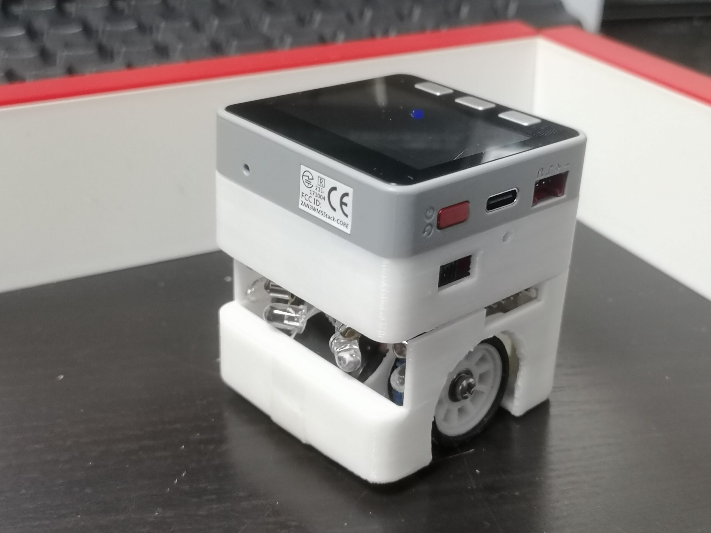

# M5Mouse

A micro mouse PCB module & Software for M5Stack.

## Documents

Assembly and proguramming instructions are documented in the blog series "ししかわのマウス研修（Sskw's micro mouse training）"

- [Japanese](https://rt-net.jp/mobility/archives/9589#toc2)
- [English (auto translate)](https://1-rt--net-jp.translate.goog/mobility/archives/9589?_x_tr_enc=1&_x_tr_sl=ja&_x_tr_tl=en&_x_tr_hl=en-US&_x_tr_pto=nui#toc2)

